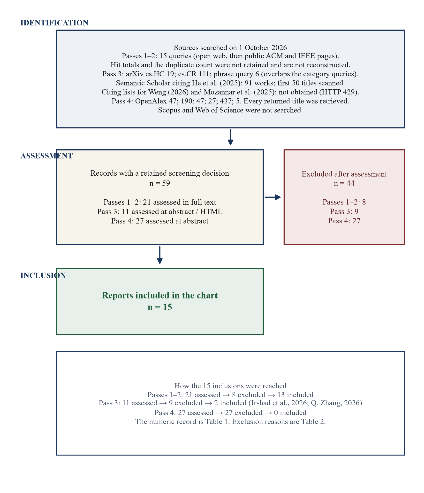
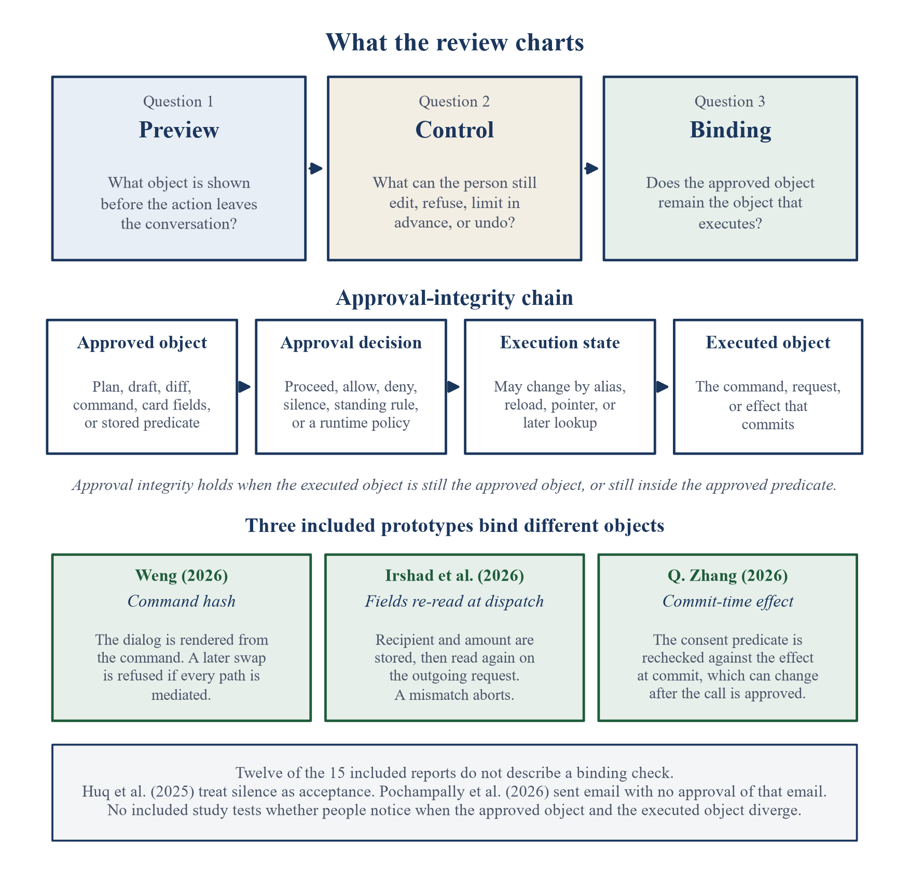
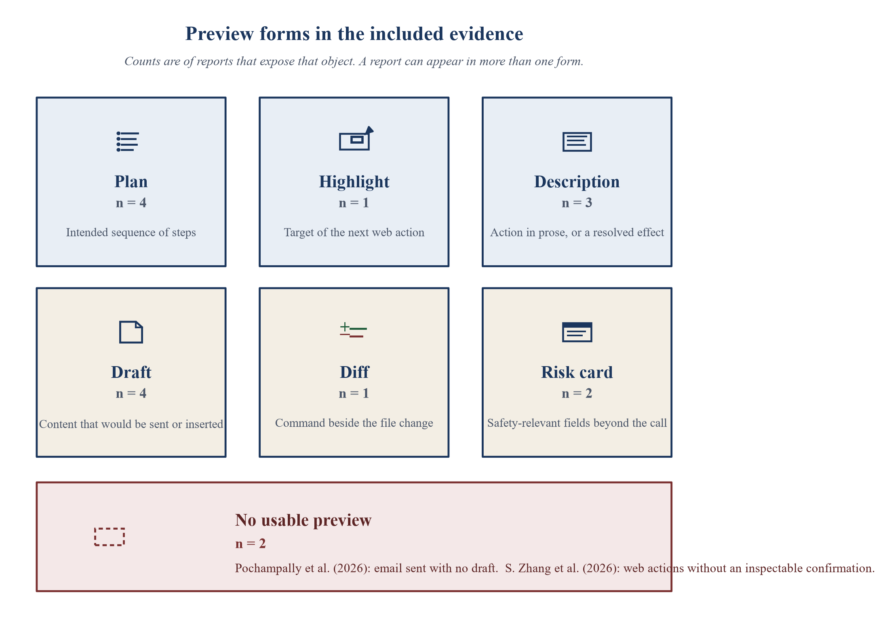

# Before It Acts: A Scoping Review of Preview and Approval in Agentic AI Interfaces

Article type: State-of-the-Art Review

## Abstract

Agentic systems can send a message, change a file, or spend money at the moment a person is asked to approve. This scoping review asks what agentic interfaces reported in the included evidence show before that action leaves the conversation, which controls the person is reported to have, and whether the approved object remains the object that executes. Searches on 1 October 2026 used public web sources, public publisher pages, a preprint repository, a partial citation chase, and an open scholarly index. Two major subscription databases were not searched. Fifty-nine records were assessed and fifteen were charted. Where a preview is described, it takes one of six forms: a plan, a highlight, a description, a draft, a diff, or a risk card. Two reports describe consequential actions with no usable preview. Three technical prototypes check whether approval stays bound to execution. They bind a command, browser fields re-read at dispatch, or a commit-time effect. No included study tests whether people notice a mismatch. Approval integrity is a property read from this chart, not a validated construct. The design statements are propositions.

**Keywords:** HCI design and evaluation methods; Interactive systems and tools; Empirical studies in HCI; user interface design; action preview; approval integrity

## 1. Introduction

A confirmation can be clicked after an agent has already drafted the email, chosen the command, or filled the cart. The design question is narrower than whether people have agency in conversation with a model. It is what the interface shows before an action changes something outside the conversation, what the person can still change or refuse, and whether the object that was approved is the object that runs.

Three reviews bound that question. Y. Wang and G. Wang (2026) scoping-reviewed how user autonomy is supported in interaction with large language models. Human approval appears in their catalog as one mechanism among others. Michael and Roesner (2026) surveyed how a person specifies a permission policy and how that policy is enforced. P. Wang, Li, and Tian (2026) coded runtime approval along six dimensions, including how much information about the action is presented at decision time. None of these reviews charts, study by study, what the person can still edit, refuse, or undo, or whether the approval remains bound to the executed action.

The studies gathered here differ in domain. They include a simulated daily assistant, a browser extension, a document editor, a seminar-scheduling agent, and a coding-agent dialog. They share one situation: an agent proposes an action that can leave the conversation, and the interface either shows that proposal or does not.

The review asks three questions.

1. What object do agentic interfaces reported in the included evidence present before an action changes state outside the conversation?
2. For each interface, what does the source report about editing that object, refusing it, limiting its scope in advance, and undoing it after execution?
3. Which reports bind the approved object to the object that executes, and what evidence tests whether people notice when the two diverge?

The questions preserve the scope of the deposited protocol. They separate the preview, the control, and the binding, which the earlier wording folded into one request for design guidance.

This review makes three claims, and they are not equal. First, it groups the previews that do appear into six forms: plan, highlight, description, draft, diff, and risk card. That grouping is a synthesis of the included reports. P. Wang, Li, and Tian (2026) already distinguish several of the same display types. Second, it charts the controls each report actually describes. Third, it treats approval integrity as a further property: the approved object, the approval decision, the state at execution, and the executed object can come apart. Security work has already named pieces of that property. Weng (2026) names consent integrity. Alpay and Alpay (2026) use approval integrity for a different object, a language-model answer checked at publication, and that paper is excluded here. Q. Zhang (2026) names stale consent, the case in which an approved call commits a broader effect because state changed. What this review adds is the placement of that binding inside an HCI chart of approval screens. The placement is a proposition from the chart. It is not a finding that people detect the mismatch, and it is not a test that one preview form outperforms another.

The chain used below is deliberate. The **approved object** is what the person is shown or what a stored predicate describes: a plan step, a draft, a diff, a command, card fields, or a resolved effect. The **approval decision** is the proceed, allow, deny, silence, standing rule, or, in Q. Zhang (2026), a runtime policy asked to approve in the user’s place. The **execution state** is the state at commit, which may have changed through alias resolution, a reloaded page, a pointer, or a later lookup. The **executed object** is the command, request, or effect that commits. Approval integrity, as used in this paper, means that the executed object is still the approved object, or still inside the predicate that was approved. The three prototypes operationalize that relation differently. The review does not collapse them into one mechanism.

## 2. Related work

### 2.1. What prior reviews already established

Y. Wang and G. Wang (2026) reviewed 80 papers on user autonomy in human–LLM interaction and grouped mechanisms into scaffolding, steerability, reflection, transparency, and collaborative coordination. Human-in-the-loop verification sits in that catalog as a way to keep decision authority with the person. Their corpus is organized by the kind of support a mechanism offers. This review uses the opposite cut: the pending action, and the controls attached to it.

Michael and Roesner (2026) reviewed 21 proposals for user-level permissions and walked through five commercial agents. Their taxonomy covers how a policy is specified, how a selection becomes a rule, and how the rule is enforced. In that walkthrough, a setting labeled as needing approval did not always pause the agent. In one observed case, a draft was created without a prompt. That observation belongs with the question of whether a control does what its label says. Their paper does not extract, for each interface, the contents of the preview or the binding between approval and execution.

P. Wang, Li, and Tian (2026) treat agent security as an agent–human interaction problem. For runtime approval, the category that pauses execution for a person, they organise the design space by what is approved, the granularity, the trigger, the response options, fatigue mitigation, and how much information is presented at decision time. On that last dimension they distinguish a minimal prompt, the raw command, a command plus a risk explanation, a diff, an abstract plan, and a multi-layer summary. They report runtime approval in 15 of 21 production systems and connect frequent prompts to warning fatigue. Their unit is the security mechanism, counted across papers, production systems, and plugins. They do not chart, for each interface, edit, refusal, undo, or binding to the executed action.

### 2.2. What this review synthesizes, and what it does not claim

The addition is a chart of included interface reports: what each preview exposes, what the person can still edit, refuse, or undo, and whether the source binds approval to execution. The six preview forms are the grouping used for that chart. They sit close to the display types in P. Wang, Li, and Tian (2026). They are not offered as a new theory of autonomy.

The binding property is not original to this review. Consent integrity (Weng, 2026), approval integrity in the sense of Alpay and Alpay (2026), and stale consent (Q. Zhang, 2026) already name failures in which agreement and execution diverge. Alpay and Alpay (2026) are excluded because the object is a published answer, not an agent action leaving the conversation. This review uses approval integrity for the HCI question of whether an approval screen still refers to the action that runs. That use is a synthesis term. It is not a claim that the construct has a standard measure or that the included user studies validated it.

### 2.3. Work that marks the edge of the search

Adjacent HCI work was screened and excluded when no external action was held for approval. VeriPlan asks a person to confirm constraints on an end-user plan and then checks the plan (Lee et al., 2025). WaitGPT visualizes analysis code as it is generated so a person can steer the analysis (Xie et al., 2024). Aporia collects design decisions and then implements them; the code change is not the object on the approval screen (Kasibatla et al., 2026). Zhou et al. (2025) model when a confirmation should be requested. AGDebugger lets a developer edit and reset agent messages, and its authors note that an email already sent cannot be pulled back by that reset (Epperson et al., 2025). CUGA pauses for a tool-approval checkpoint, but the demo does not describe what the person sees on that checkpoint (Shlomov et al., 2026). Those papers mark the boundary. They are not rows in the extraction.

## 3. Method

The review is reported against PRISMA-ScR (Tricco et al., 2018). The protocol, search log, screening log, extraction sheet, and checklist are the review record. The review protocol is dated 1 October 2026 and was not prospectively registered. A formal quality-appraisal instrument was not applied to the included sources. The unit of analysis is one evidence report describing an agentic interface at the moment before an action changes something outside the conversation. A report that describes two surfaces, such as an email draft and a code diff, can contribute to two preview forms. It remains one row in the extraction.

Counts in this paper are of two kinds only. A review count uses the 15 included rows, or the 59 assessed records, as its denominator. A source count is a number printed by the included paper and is not recomputed. For the first two search passes, complete hit counts and duplicate counts were not retained in the contemporaneous search record. Accordingly, these quantities are not reconstructed retrospectively. The screening flow is reported from the records for which screening decisions were retained.

### 3.1. Eligibility criteria

A report was included if it describes a generative or agentic interface in which a person can see a proposed action before that action changes something outside the conversation, or if it reports what the person could inspect or refuse at that moment. Eligible actions are a message, a file change, a purchase, a booking, a web step, a shell command, or another tool call. Preprints were eligible and are labeled as preprints. A security paper was included only when it describes the approval surface a person would see, not merely a guard that runs without that surface.

A report was excluded if it studied chatbot usability or co-writing with no pending external action, modeled when to ask without describing the screen, verified a plan that is not executed, surveyed permission architectures without extracting one approval surface, or was documentation or a pattern guide. Three neighboring reviews were cited as boundaries and were not extracted as interface cases: Y. Wang and G. Wang (2026), Michael and Roesner (2026), and P. Wang, Li, and Tian (2026). Papers that name a binding failure but do not describe one preview were excluded from the chart and cited in Section 4.4.

### 3.2. Information sources and search strategy

All searches were run on 1 October 2026. The search strings and API queries are provided in the search log to support reproducibility. Scopus and Web of Science were not searched. ACM and IEEE were not queried through an institutional export.

The first pass was an open web search. The second opened public ACM Digital Library and IEEE Xplore pages. Fifteen queries combined approval, preview, action guards, co-planning, and tool use with venue and year limits for 2024–2026. Hit totals from these two passes were not retained, and the number of duplicate titles removed was not retained. Software-development kits, pattern guides, forum posts, and IEEE abstracts on physical-robot motion were set aside and were not given screening-log rows. These two passes assessed 21 scholarly records in full text. Eight were excluded. Thirteen were included.

The third pass used the arXiv API. The `cs.HC` query returned 19 results, the `cs.CR` query returned 111, and a phrase query for consent integrity, approval integrity, stale consent, the verifiable action card, and approval laundering returned 6, overlapping the category queries. All 111 `cs.CR` titles were scanned. A record was opened when the title concerned an approval surface, a binding between approval and execution, or a review of that surface. A direct ACM Digital Library search returned a bot-check page and no count. Semantic Scholar listed 91 works citing He et al. (2025). The first 50 titles were scanned. Titles 51–91 were not opened. Citing lists for Weng (2026) and Mozannar et al. (2025) returned HTTP 429, and Google Scholar citing lists were not retrieved. This pass assessed 11 further records. Nine were excluded. Irshad et al. (2026) and Q. Zhang (2026) were included.

The fourth pass queried OpenAlex. Six queries returned 47, 190, 47, 27, 437, and 5 works, and every returned title was retrieved. The title list is deposited with the review record. Software releases, datasets, and duplicate deposit versions were set aside. A record was assessed when the title concerned a human approval surface, a binding, or a review of that surface, or when it named a guard that might show a person a pending action. Automated guard-model titles with no person-facing preview were not all assessed. Twenty-seven further records were assessed at abstract. J. Liu et al. (2026) was also read in HTML. All 27 were excluded.

The Q. Zhang (2026) workshop PDF was read on 2 October 2026 and replaces an earlier web-page abstract that reported 1,377 proposals and a 7.8 percent unsafe rate. The PDF reports 1,500 valid proposals and does not specify the screen layout. Publisher PDFs for S. Zhang et al. (2026) and Kretzer et al. (2025) returned HTTP 403. Those two rows use the publisher HTML.

The screening log lists 59 assessed records, 44 exclusions, and 15 inclusions. The extraction sheet has the same 15 inclusions. Figure 1 shows the flow. Table 1 is the numeric record. Table 2 gives the exclusion reason for each assessed record.

### 3.3. Study selection

There was one screener and no second human screener, so no inter-rater agreement statistic was calculated. All records were screened by the author against the predefined eligibility criteria. The author assessed titles and abstracts where available and examined full texts for potentially eligible reports. Inclusion decisions were based on the eligibility criteria described above. The screening log records those decisions.

Full text was used for the 21 records from the first two passes. The 11 third-pass records were assessed at abstract and in full HTML where HTML was available, and the Q. Zhang PDF was read on 2 October 2026. The 27 fourth-pass records were assessed at abstract, with HTML also read for J. Liu et al. (2026). An abstract-only exclusion can be wrong if the full text describes a preview the abstract omits.

### 3.4. Data charting

Data were charted by the author using a structured extraction framework developed from the research questions and refined during full-text review. Each included report is one row. The charted fields are the proposed action, what is shown, what can be edited, the refuse path, reversibility, whether approval is tied to the executed action, the study design, the sample, and the result as published. The author verified each extracted field against the corresponding source. A cell is “not reported” when the source does not say. Charting was not duplicated by a second person. The Q. Zhang (2026) figures are from the workshop PDF. Two included reports, S. Zhang et al. (2026) and Kretzer et al. (2025), were charted from the publisher’s web page after the document download was refused.

### 3.5. Synthesis

The author applied four analytical codes to the extracted data to organize the synthesis. These codes were used for descriptive and thematic comparison and were not intended as measures of study quality.

**Preview form.** The “what is shown” cell is assigned to a form by the object it exposes. A plan exposes an intended sequence of steps. A highlight exposes the target of the next web action. A description exposes the action in prose, or a resolved effect whose visual layout is not specified. A draft exposes content that would be sent or inserted. A diff exposes a command beside the file change. A risk card exposes safety-relevant fields beyond the bare action, such as source, permission, recipient, or amount. A report with two objects is counted in two rows of Table 4 and remains one included study. A report that describes the consequential action as not shown is coded as no usable preview. A binary prompt whose displayed content is not specified, such as the action guard in Mozannar et al. (2025), is not given a seventh form. It is coded as a control.

**Edit.** Present if the source describes changing the plan or the pending content before commit. Absent from that code if the source describes only a later hand correction, a new recommendation, or no edit. Mozannar et al. (2025) are coded as plan-only, because the action-guard prompt is described as binary.

**Refuse, scope, and undo.** Refuse is present if the source describes a way to withhold the pending action, including by not clicking. Scope is present if the source describes a limit set before that action appears, such as a standing rule or a template. Undo is present only if the source describes reversing an effect that has already left the machine. A simulated retry, a step rerun, and a recovery attempt after a block are reported in the text and are not coded as undo of an external commit.

**Binding.** Yes if the source describes a check, at or before commit, that the executed object still matches the approved object or remains inside the approved predicate. No if the source describes the action running without an approval of that action, or describes silence as acceptance. Not reported if the source neither describes such a check nor describes a divergence. A session that cannot diverge because the researchers fixed the descriptions, as in Yan (2026), is coded not reported. That is a property of the experiment, not a binding in the interface.

Evidence type is taken from the study-design cell: participant experiment, qualitative or field study, system description, proxy evaluation, or security prototype. Participant experiments are not pooled with prototype benchmarks.

Section 4 reports the result of applying these codes to the 15 rows. Section 5.3 states a design proposition only where the coded chart supports the reading, and each proposition names the question the chart does not answer. The propositions are not a tested framework.

A formal quality-appraisal instrument was not applied. Critical synthesis in this review is the separation of evidence types, the distinction between technical prototypes and participant evidence, and the identification of gaps that the included reports do not close. A security prototype is not treated as evidence that people notice a mismatch. A participant study is not treated as a comparison of the six preview forms unless it made that comparison.

Generative AI disclosure: A generative tool, Grok 4.7 accessed through Cursor, was used to draft and revise manuscript prose. The author independently screened the records, charted the included reports, applied the analytical codes, verified the extracted content against the sources, and takes responsibility for the manuscript.

**Table 1. Screening flow for the searches of 1 October 2026.**

| Stage | n | What the number means |
| --- | --- | --- |
| Queries, first two passes | 15 | Open web, then public ACM and IEEE pages. Hit totals were not retained. |
| Non-scholarly pages set aside | Not counted | Software-development kits, pattern guides, and forum posts. |
| Robot-motion abstracts set aside | Not counted | IEEE pages on physical-robot previews. |
| Duplicate titles removed | Not counted | Only the count after collapse was retained. |
| Records assessed in full text, first two passes | 21 | Sixteen from the first pass and five from the second. |
| Excluded from that assessment | 8 | Rows 1–8 of Table 2. |
| Included from that assessment | 13 | |
| arXiv `cs.HC` query, third pass | 19 | API `totalResults`. Not all titles were assessed in full text. |
| arXiv `cs.CR` query, third pass | 111 | API `totalResults`. Titles were scanned. |
| arXiv phrase query, third pass | 6 | Overlaps the two category queries. |
| ACM Digital Library search | Not obtained | The search page returned a bot check and no result count. |
| Citing works of He et al. (2025) | 91 | Semantic Scholar. The first 50 titles were scanned. |
| Citing works of Weng (2026) and Mozannar et al. (2025) | Not obtained | Semantic Scholar returned HTTP 429. |
| Additional records assessed, third pass | 11 | Abstract, plus full HTML where available. |
| Excluded from that assessment | 9 | Rows 9–17 of Table 2. |
| Included from that assessment | 2 | Irshad et al. (2026); Q. Zhang (2026). |
| OpenAlex queries, fourth pass | 47; 190; 47; 27; 437; 5 | Every title was scanned. Software releases and datasets were set aside. |
| Additional records assessed, fourth pass | 27 | Abstract. J. Liu et al. (2026) was also read in HTML. |
| Excluded from that assessment | 27 | Rows 18–44 of Table 2. |
| Included from that assessment | 0 | |
| Included in the extraction | 15 | Table 3. Fifteen data rows in `review/extraction.csv`. |

**Table 2. Records excluded after assessment, in the current log.**

| Record | Reason |
| --- | --- |
| Y. Wang and G. Wang (2026) | Reviews autonomy mechanisms. It does not map a pending-action preview. Cited as a boundary. |
| Michael and Roesner (2026) | Surveys permission policies and enforcement. Cited as a boundary. |
| Lee et al. (2025) | The person confirms plan constraints. No external action is executed. |
| Xie et al. (2024) | Visualizes analysis code as it is generated. It does not hold an external action. |
| Kasibatla et al. (2026) | The person approves design decisions. The later code change is not the object on the screen. |
| Zhou et al. (2025) | Models when a confirmation should be requested. It does not describe the screen. |
| Epperson et al. (2025) | A developer can reset agent messages. A sent email cannot be undone that way, and the external action is not previewed. |
| Shlomov et al. (2026) | Pauses before a sensitive tool. The demo does not describe the approval screen. |
| P. Wang, Li, and Tian (2026) | Analyses runtime approval, including information shown at decision time. Cited as a boundary. |
| Cheng et al. (2026) | Maps the user-experience design space of computer-use agents. It does not extract one preview. |
| Chen et al. (2026) | Compares when oversight returns. The abstract does not describe a pending-action preview. |
| Grunde-McLaughlin et al. (2026) | Studies action traces used to find errors. The trace is not a gate on an external action. |
| Alpay and Alpay (2026) | Binds an approved language-model answer to a publication check. The object is not an agent action leaving the conversation. |
| H. Zhang et al. (2026) | Checks persistent outcomes against an application approval. It does not describe a preview a person sees. |
| Y. Wang (2026) | Systematises six post-approval substitutions in coding-agent harnesses. Cited with the integrity finding. It is not one preview. |
| Kumar (2026) | Names attacks in which the approved operation and the executed operation differ. Cited with the integrity finding. |
| J. Zhang et al. (2026) | An approval record can name a command while the launched workflow has further effects. Cited with the integrity finding. |
| Z. Wang (2026a) | Defines a canonical action identity a later verifier can reproduce. It does not describe a person-facing preview. |
| Z. Wang (2026b) | Describes approval as a certificate checkpoint. It does not describe the screen. |
| Zhu et al. (2026) | The action presented for approval can be reconstructed before execution. Cited with the integrity finding. |
| Saleme (2026) | Compares whether three protocol records bind approval to execution. It does not describe a preview. |
| Kollia (2026) | Revalidates whether a recorded approval is still the current authority. It does not describe the screen. |
| Yuan et al. (2026) | Can hold a high-risk tool call. It does not describe what the approval shows. |
| Qin et al. (2026) | Enforces action-time authorization in the runtime. It does not describe a person-facing preview. |
| Turan (2026) | Models which actions to escalate. It does not describe the screen. |
| S. Kang et al. (2026b) | Verifies policy steps. It does not describe a pending-action preview. |
| S. Kang et al. (2026a) | Mentions user confirmation as a policy requirement. It does not describe the screen. |
| J. Liu et al. (2026) | Compares permission architectures in three coding agents. It does not extract the preview. |
| Kadaboina (2026) | A consent protocol between agents. It is not a screen a person sees. |
| Qu et al. (2026) | Measures out-of-scope actions and names an ask-to-continue framework. It does not describe that screen. |
| X. Yang et al. (2026) | Routes an action to allow, replan, or confirmation. It does not describe the confirmation screen. |
| Y. Zhang et al. (2026) | Benchmarks automated guardrails that over-refuse. It is not a person-facing preview. |
| Salfeld-Nebgen (2026) | Requires attested evidence before execution. It does not describe a preview. |
| Medda and Gong (2026) | A care-workflow architecture with a human hand-off. It does not describe an approval screen. |
| Katkar et al. (2026) | A cryptographic gate on tool calls. It does not describe a person-facing preview. |
| D. Z. Liu (2026) | A benchmark of consent constraints. It does not describe an approval screen. |
| Sharma (2026) | Runtime validation of telecom decisions. It does not describe a person-facing preview. |
| Mou et al. (2026) | An automated step-level guardrail. It does not describe a person-facing preview. |
| Y. Feng et al. (2026a) | A guard model under user-defined policies. It does not describe an approval screen. |
| Xiang et al. (2024) | A guard agent that checks actions against safety requests. It does not describe a person-facing preview. |
| Y. Feng et al. (2026b) | A guard model for computer-use trajectories. It does not describe an approval screen. |
| Agarwal et al. (2026) | Trains the agent to act or refuse. The refusal is the model’s. |
| Zhijie Zheng et al. (2026) | A step-level guard model. It does not describe a person-facing preview. |
| Zihao Zheng et al. (2026) | Compares commit-time guards under state races. Cited with the integrity finding. It does not describe a preview a person sees. |

## 4. Results

Section 4 applies the codes in Section 3.5 to the 15 extracted rows. Review counts use that denominator. Numbers from an included paper are attributed to that paper and are not recomputed. Figure 2 restates the three questions and the approval-integrity chain used to organize the chart.

### 4.1. Characteristics of the included studies

Table 3 summarizes the 15 reports. Seven are journal or conference papers: He et al. (2025), Kretzer et al. (2025), Huq et al. (2025), Feng et al. (2026), Lehmann et al. (2026), S. Zhang et al. (2026), and Su et al. (2026). One, Q. Zhang (2026), is a workshop paper. Seven are preprints: Mozannar et al. (2025), Long et al. (2025), Zhuang et al. (2026), Yan (2026), Weng (2026), Pochampally et al. (2026), and Irshad et al. (2026). A secondary index lists Zhuang et al. as accepted to a 2026 demonstration track. That proceedings record was not verified, so the paper is cited from its preprint.

The evidence types are not interchangeable. Two reports compare conditions with participants and report inferential statistics: He et al. (2025), on involvement in planning and execution, and Yan (2026), on permission regimes. Feng et al. (2026), Long et al. (2025), Lehmann et al. (2026), Mozannar et al. (2025), Pochampally et al. (2026), and S. Zhang et al. (2026) report lab, field, interview, or trace evidence about a specific interface or about agents already in use. Huq et al. (2025) report case studies of a browser extension. Zhuang et al. (2026) and Kretzer et al. (2025) are system descriptions or demonstrations. Su et al. (2026) score traces with a proxy. Weng (2026), Irshad et al. (2026), and Q. Zhang (2026) evaluate security prototypes and report no user study.

**Table 3. Included reports in the current extraction.**

| Study | Status | Evidence type | What was examined | People or cases |
| --- | --- | --- | --- | --- |
| He et al. (2025) | CHI 2025 | Participant experiment | Simulated assistant; plan, then predicted action | 248 |
| Kretzer et al. (2025) | CHI 2025 | Interface description | Component recommendation before it is drawn into a file | Not a preview user study |
| Huq et al. (2025) | NAACL 2025 demo | Case studies | Next web action in a browser extension | Case studies |
| Mozannar et al. (2025) | Preprint | Qualitative study | Plan editor and action guard | 12 |
| Long et al. (2025) | Preprint | Lab study and deployments | Plan and email drafts before send | 10 lab; 3 deployments |
| Feng et al. (2026) | CHI 2026 | Lab comparison and field deployment | Editable research plan in a document | 16 lab; 7 field |
| Lehmann et al. (2026) | CHI 2026 | Field study | Side-by-side preview before a document change is approved | 30 people; 14 teams |
| S. Zhang et al. (2026) | CHI 2026 | Posts and interviews | GUI agents that act on the web | 221 posts; 21 interviews |
| Su et al. (2026) | Journal 2026 | Proxy evaluation | Risk card versus log and text warning | 18 runs; 13,068 proxy-scored samples |
| Zhuang et al. (2026) | Preprint | System description | Email confirmation and code diff | No user study |
| Yan (2026) | Preprint | Participant experiment | Per-action approval versus standing rules | 113 |
| Weng (2026) | Preprint | Security prototype | Whether the dialog matches the command | No user study |
| Pochampally et al. (2026) | Preprint | Participant study | Agent that sent email without a preview | 20; screening survey 64 |
| Irshad et al. (2026) | Preprint | Security prototype | Browser card rebuilt from the pending action and checked again at dispatch | 24 scenarios; no user study |
| Q. Zhang (2026) | ICML 2026 workshop | Security prototype | Resolved effect, rechecked before execution | 1,500 proposals; no user study |

### 4.2. Preview forms

Thirteen of the 15 reports describe a preview of a pending action. Two describe the consequential action without one: Pochampally et al. (2026) report an email sent with no draft, and S. Zhang et al. (2026) report purchases, installs, and other web actions taken without a confirmation the person could inspect. The 13 previews do not show the same object. Figure 3 and Table 4 group those that share an object. A report can appear in more than one row when it shows more than one object. Q. Zhang (2026) is listed under description because the approved object is a resolved effect rather than a widget the paper specifies. The PDF does not specify the visual layout, so that placement is the weakest in the table.

**Table 4. Preview forms in the current chart.**

| Form | What it exposes | Control the source describes | Reports | n |
| --- | --- | --- | --- | --- |
| Plan | The intended sequence of steps | Edit, add, delete, split, or assign a step | He et al. (2025); Feng et al. (2026); Mozannar et al. (2025); Long et al. (2025) | 4 |
| Highlight | The target of the next web action | Reject or pause. Silence runs the action within five seconds | Huq et al. (2025) | 1 |
| Description | The action in prose, or a resolved effect whose layout is not specified | Allow or deny, or a standing allow, ask, or never rule. Q. Zhang (2026) does not describe editing the effect | Yan (2026); Weng (2026), for agent-written command summaries; Q. Zhang (2026) | 3 |
| Draft | The content that would be sent or inserted | Edit, regenerate, compare, or withhold the commit | Long et al. (2025); Zhuang et al. (2026), for email; Lehmann et al. (2026); Kretzer et al. (2025) | 4 |
| Diff | The command and the file change | Approve a hunk, annotate a line, or request a partial rewrite | Zhuang et al. (2026), for code | 1 |
| Risk card | Source, sensitivity, permission, and consequence, or the verb, recipient, amount, and provenance | Safer-alternative controls, or Deny as the prominent control. Neither paper reports that a person rewrites the call | Su et al. (2026); Irshad et al. (2026) | 2 |
| No usable preview | The consequential action is not shown first | Not available for that action | Pochampally et al. (2026), email task; S. Zhang et al. (2026) | 2 |

The forms are not substitutes, and the chart does not show that any one of them improves outcomes relative to the others. A plan names steps. He et al. (2025) then show, in the conversation, the single simulated API action predicted for the current step. Feng et al. (2026) show the plan as a list in the document, with status and outputs. A description names an action in words. In Yan (2026) those words were fixed by the researchers, and every condition saw the same descriptions. In the agents Weng (2026) characterizes, the confirmation text is written by the agent, so the description can name a benign action while another command is queued. A draft or a diff shows content that can leave the machine: the email in Long et al. (2025) and Zhuang et al. (2026), the suggestion beside the text it would replace in Lehmann et al. (2026), the components before Draw Suggestion in Kretzer et al. (2025), and the command with a unified diff in Zhuang et al. (2026). A risk card adds why the call might be unsafe. A highlight shows where a click will land, and only for a few seconds (Huq et al., 2025).

Mozannar et al. (2025) also use a yes-or-no action guard. The paper does not specify how much of the pending action that prompt displays, so the guard is charted as a control in Section 4.3 rather than as a seventh form.

What remains unknown is whether these forms differ in comprehension or in the decisions people make. No included study crosses the six forms on one consequential action.

### 4.3. User controls

Table 5 charts four controls against the 15 reports: editing the pending object, refusing it, limiting scope before the action appears, and undoing an external effect after it has committed. “Not reported” means the source, as charted, does not describe that control. It does not mean the control is impossible.

**Table 5. Controls charted for the 15 included reports.**

| Study | Edit the pending object | Refuse | Limit scope in advance | Undo after an external commit | Binding check |
| --- | --- | --- | --- | --- | --- |
| He et al. (2025) | Edit, add, delete, or split a plan step. Specify Action fills parameters. Feedback requests a new prediction | Do not click Proceed. No timeout is described | Not reported | Simulated retry only. Execution is simulated | Not reported. Proceed runs the prediction just shown |
| Feng et al. (2026) | Edit the plan, request alternative wording, reassign a step, delete output items, rerun | Delete, reassign, or take over. No separate reject control for a side effect | Not reported | Rerun a step. External undo is not reported | Not reported. Execution follows the current plan text |
| Huq et al. (2025) | Not the suggestion. The person can act elsewhere on the page | Reject or pause. Silence executes within five seconds | Not reported | Not reported | No. Silence is acceptance |
| Mozannar et al. (2025) | The plan can be edited. The action guard is binary | Disapprove, only for actions classed as needing a guard | Not reported | Not reported. Participants asked to revise a completed step | Not reported |
| Long et al. (2025) | Edit or regenerate the email draft. Revise policies and templates | Explicit confirmation before send | Policies and templates shape later drafts | Not reported as recall of a sent email | Not reported |
| Zhuang et al. (2026) | Rewrite, edit, or delete email paragraphs. Approve a code hunk, annotate a line, or request a partial rewrite | Explicit confirmation before send | Not reported | Not reported | Not reported |
| Yan (2026) | Not the action on the screen | Deny, or a never rule for a category | Allow, ask, or never rules for consequence categories | Not reported | Not reported. Descriptions were fixed before the session |
| Weng (2026) | Not reported as a user edit of the command | Withhold approval. The prototype refuses a hash mismatch | Not reported | Not reported | Yes, in the prototype, if every path is mediated |
| Pochampally et al. (2026) | Not reported for the email that was sent | Absent on the email task | Not reported | The email was treated as irreversible. Recall is not described | No. The sent email was not approved |
| Su et al. (2026) | Safer-alternative controls. Rewriting the call is not reported | The card is a confirmation surface. A person refusing was not observed | Not reported | Not reported | Not tested. The card is meant to show the proposed state change |
| S. Zhang et al. (2026) | People corrected agents by hand after the fact, including by shadowing the cursor | Sometimes absent | Not reported as a control of the studied agents | Often none, including a double purchase | Not reported |
| Lehmann et al. (2026) | Edit the suggestion before approval | Do not append or replace | Not reported | Not reported after approval. Colored text is editable before approval | Not reported |
| Kretzer et al. (2025) | Another recommendation can be generated. In-place editing is not described | Do not click Draw Suggestion | Not reported | Not reported | Not reported |
| Irshad et al. (2026) | Not reported | Deny. A mismatch at dispatch aborts and raises the card again | Not reported | Not reported | Yes. Recipient and amount are re-read at dispatch |
| Q. Zhang (2026) | Not reported | The user, or a runtime policy, is asked to approve. The refuse control is not named | Not reported | Not undo of a commit. Recovery after a block succeeded in 8 of 50 blocked tasks | Yes. The commit-time effect is rechecked against the stored predicate |

Editing is described for the plan or the pending content in He et al. (2025), Feng et al. (2026), Mozannar et al. (2025) for the plan only, Long et al. (2025), Zhuang et al. (2026), and Lehmann et al. (2026). That is six reports. The other nine do not describe rewriting the pending action. Where an experiment reports how often people used the edit, the rates are modest or highly task-specific. In He et al. (2025), 104 of 121 participants in the user-involved planning conditions edited at least one plan. Specify Action was used 445 times, feedback before execution 91 times, and feedback after execution 163 times. In Feng et al. (2026), 32.6 percent of lab steps were edited and 17.4 percent were reassigned, so most proposed steps were accepted as written. Participants deleted 16.3 percent of the output items the agent surfaced. These two studies show that an edit control is used. They do not show that editing is the usual response.

Refusal is also not one control. He et al. (2025), Long et al. (2025), and Zhuang et al. (2026) require an explicit confirmation. Yan (2026) offers deny, or a never rule. Huq et al. (2025) offer reject and pause, and also treat silence of at most five seconds as acceptance. Mozannar et al. (2025) ask only for some actions: always-irreversible actions need a yes or no, never-irreversible actions do not ask, and a model may decide whether a maybe-irreversible action asks. Pochampally et al. (2026) document an email task with no refuse step. On that task, preference for approval prompts averaged 4.65 and trust averaged 3.10 on five-point scales. The authors call the resulting dissatisfaction delegation regret and report that it followed actions beyond what the student would have authorized, including when the output was rated successful. S. Zhang et al. (2026), from 221 posts and 21 interviews, describe the same absence in everyday web agents, including double purchases, and report that people shadowed the cursor. The authors recommend explicit confirmation for payments, identity, and outbound messages. That recommendation is theirs. It is not a tested preview.

Scope can be limited before the action appears in two reports. Yan (2026) lets the person write allow, ask, or never rules for consequence categories. Long et al. (2025) let the organizer revise policies and templates that shape later drafts. Mozannar et al. (2025) place the classification of irreversible actions with the developer, not with the participant. In Yan (2026), standing rules blocked less overreach than per-action approval, by 20.1 percentage points (95 percent confidence interval −32.1 to −8.1), and less than automated review, by 14.5 percentage points (95 percent confidence interval −25.8 to −3.2). Prompts fell from 18.0 under per-action approval to 10.9 under the policy. Total time was not reliably lower once the time to write the rules was included. Participants chose “ask” for 114 of 140 rules. Of 148 overreach actions executed under the policy, 133 followed a human approval and 15 ran under an allow rule. An ask rule postponed the decision. It did not, by itself, stop the action.

Undo after an external commit is not established in this chart. He et al. (2025) allow a simulated retry. Feng et al. (2026) allow a step to be rerun. Mozannar et al. (2025) heard requests to revise a completed step. Q. Zhang (2026) report a recovery attempt after a block, which is not the recall of a committed effect: 8 of 50 blocked tasks were recovered, and in 34 of those 50 the agent declined to continue without renewed approval. No included paper describes recalling a sent email or reversing a payment from the approval surface.

### 4.4. Approval integrity

Approval integrity, as defined in Section 1, is the relation between the approved object and the executed object. Twelve of the 15 reports do not describe a check that enforces it. Three prototype a check. None of the three asks a person whether the mismatch was visible.

He et al. (2025) execute, inside a simulation, the prediction the person has just seen. The paper does not describe a later substitution, and it does not describe a check against one. Feng et al. (2026) execute the current text of a step. Long et al. (2025) send the draft the organizer has read in the live-mail deployments and do not describe a check against a rewritten payload. Zhuang et al. (2026), Mozannar et al. (2025), Yan (2026), Su et al. (2026), S. Zhang et al. (2026), Lehmann et al. (2026), and Kretzer et al. (2025) do not report a binding. Yan’s session could not diverge during the study, because the descriptions were fixed before anyone arrived. That is a property of the experiment, not a binding in the interface.

Two reports are explicit failures of the relation. Huq et al. (2025) run the displayed suggestion if the person is silent for at most five seconds. Acceptance is the absence of a rejection, not a decision attached to a frozen action. Pochampally et al. (2026) sent the email without an approval of that email.

The three prototypes bind different objects. Those bindings are the bottom row of Figure 2.

Weng (2026) hashes the command. The dialog in the prototype is rendered from the command by a component the agent cannot rewrite, and a command the prototype cannot inspect is marked uninspectable or high risk rather than safe. Three post-approval swaps were refused because the hash of the executed action differed from the approved action. The paper states that this holds only when every execution path is mediated. On 11 standard and 11 adaptive cases in which the agent wrote the narration, a narration-trusting dialog approved every case, and the prototype flagged them. Those figures evaluate the prototype.

Irshad et al. (2026) store the recipient and the amount read from the pending browser action and read the outgoing request again at dispatch. A material difference aborts the action and raises the card again. The card is rendered in the browser chrome, not in the page. The worked example shows the verb, the recipient, the amount, a page-origin label, and an elevated-risk flag, with Deny as the prominent control. On a 24-scenario benchmark, attack success without the card ranged from 68 percent to 100 percent across the evaluated models. With the card, attack success was 0 percent on every model, legitimate-task completion was 78 percent, and the false-block rate was 0 percent. The check is the re-read at dispatch, not the presence of a card. The paper reports no user study.

Q. Zhang (2026) argues that an unchanged tool call can still commit a different effect after alias expansion, query re-evaluation, default-argument resolution, a mutable pointer, or state drift. EffectGuard stores the consent predicate from the approval-time effect and revalidates the commit-time effect. Across 1,500 valid proposals from two models, the runs produced 574 broadened-effect exposures. A no-approval baseline committed all 574. A static effect policy committed 420. Resolved-argument approval applied to 984 proposals. Under a complete runtime preview, EffectGuard committed no unsafe effects, and its unnecessary-block rate was 0.0 percent. A field-scoped snapshot blocked 388 benign cases. In a 100-case recovery pilot, unsafe final states were 0. The approval step asks the user, or a runtime policy in the user’s place, to approve. The paper does not report a user study, and it does not specify the screen.

The same failure is named in papers that were excluded because they do not describe one preview a person sees. They sharpen the claim. They do not add user tests. Y. Wang (2026) separates six ways a coding-agent harness can substitute a different action after approval. Kumar (2026) distinguishes a misrepresented operation at approval time from a substitution after the person has seen the right one. J. Zhang et al. (2026) show a record that names the approved command while the workflow it launches writes files or uses the network. Z. Wang (2026a) argues that the approved object has to be a canonical action identity a later verifier can reproduce. Zhu et al. (2026) show that the action presented for approval is often not the object ultimately consumed, because a reload, a rebinding, or a later lookup can reconstruct it. Zihao Zheng et al. (2026) separate a state change that breaks a safety predicate from one that does not: freshness checks blocked 92 to 95 percent of benign races, and a predicate check blocked none. Kollia (2026) separates a recorded approval from the authority that still holds at execution. Michael and Roesner (2026) observed a commercial agent proceed under a setting that said approval was required.

Read together, a confirmation can fail at different points in the chain. The text can be written by the agent (Weng, 2026). The page can change before dispatch (Irshad et al., 2026). The effect can drift after the call is approved (Q. Zhang, 2026). The record can omit effects the command will launch (J. Zhang et al., 2026). The approved representation can be reconstructed before it runs (Zhu et al., 2026). The label can say approval is required when the system does not pause (Michael & Roesner, 2026). None of these reports is a user test of whether people notice the mismatch.

The other results in this review do not fill that gap. He et al. (2025) found that involving the user did not raise calibrated trust. Confidence was lower when people took part in planning and when they took part in execution. A performance benefit from user-involved execution was significant on one task, where the person could correct a wrong itinerary. The authors state that this pattern does not support a general claim that user-involved execution improves performance. Feng et al. (2026) compare a document agent with a chat baseline and do not isolate the preview. Huq et al. (2025) report a 95 percent success rate in collaborative case studies, with humans performing 15.2 percent of the steps. That result describes the extension. It does not compare the five-second timeout with an explicit confirmation. Mozannar et al. (2025) report a System Usability Scale score of 74.58 from 12 participants and the preferences already cited. Long et al. (2025) report that lab participants delegated more after they could see and edit emails. They do not report a statistical test of the preview. Su et al. (2026), on traces where an injection goal had been executed, report proxy approval rates of 3.8 percent for the risk card, 13.0 percent for the plain log, and 5.9 percent for the text warning. The authors describe the scorer as a proxy for how much risk-relevant information is exposed. They do not claim that people would approve at those rates.

## 5. Discussion

### 5.1. Interpretation of the findings

The chart separates three facts that are easy to collapse. A preview can be present and still show the wrong object. A control can be present and still be a binary decision on a description the person cannot change. A confirmation can be recorded and still fail to bind the executed object.

On the first question, the included reports show six preview objects, plus two reports in which the consequential action was not shown. The six forms specify visibility. They do not specify consequence. A plan shows a sequence. A draft or a diff shows content that can leave the machine. A risk card adds a reason the call may be unsafe. A highlight shows a target for a few seconds. A description may be the researcher’s text, the agent’s text, or an effect whose layout is unspecified. Visibility of an object is therefore not one design.

On the second question, edit, refuse, scope, and undo do not travel together. Six reports describe an edit of the plan or the pending content. Refusal ranges from an explicit proceed click, through a time-limited highlight, to an email task with no ask. Scope-setting before the action appears is reported in Yan (2026) and, as policies and templates, in Long et al. (2025). In Yan (2026) that scope-setting blocked less overreach than deciding each action, largely because people chose ask and then approved. Undo of a sent message or a payment is not reported.

On the third question, a binding check is reported in 3 of 15 included papers, all technical prototypes, and in none of the participant studies. The prototypes do not check the same thing. Weng (2026) checks command identity. Irshad et al. (2026) check material browser fields at dispatch. Q. Zhang (2026) check whether the commit-time effect remains inside the approved predicate, and they allow a narrower effect. A hash of the command would not, by itself, catch the stale-consent case Q. Zhang describe. A re-read of recipient and amount would not, by itself, catch a command substitution that preserves those fields. The review’s term, approval integrity, names the relation. It does not name a single implementation.

### 5.2. Implications for HCI

The findings sit on prior HCI accounts of initiative, automation, and correction, and they add a requirement those accounts do not state.

Horvitz (1999) treated initiative as something a system should take or return under uncertainty, and treated the cost of an interruption as part of that decision. A preview is the surface at which initiative returns. The six forms differ in what is handed back. A timeout, as in Huq et al. (2025), returns initiative to the system if the person is still. Parasuraman, Sheridan, and Wickens (2000) separate automation of information acquisition, analysis, decision selection, and action implementation. In this corpus the agent has already selected an action. The open question is whether the person authorizes the implementation, and on the basis of which object. Amershi et al. (2019) ask designers to show contextually relevant information and to make correction and dismissal efficient. Editing a plan or a draft is a correction. A binary allow on a short description is a dismissal with nowhere to correct. Those guidelines do not require the approved object and the executed object to be the same.

That requirement comes from the security prototypes and from the excluded binding papers, read against the HCI chart. Weng (2026) adapts “what you see is what you sign”: a trusted display should show the object being authorized. Irshad et al. (2026) apply it to a browser card. Q. Zhang (2026) tighten it. Seeing the tool call, and binding approval to that call, is not enough when the call’s effect can change before it commits. For interface design, the implication is that a confirmation dialog is not yet a control over the action unless the chain from approved object to executed object is specified.

A faithful dialog can still fail for a different reason. Felt et al. (2015) redesigned browser SSL warnings and reported that the redesign did not meet their comprehension goal, while more users chose the safer action. P. Wang, Li, and Tian (2026) already place runtime approval next to warning fatigue. Approval integrity and habituation are different failures. The first is a mismatch between the approved object and the executed object. The second is a person who no longer reads a match. The prototypes in this corpus test the first. They do not test the second.

### 5.3. Design propositions

The following statements are propositions derived from the synthesis. No included study tested them as a set. They are not a claim that one interface is superior.

**Proposition 1. Show the object that will change.** The evidence is the split between drafts and diffs, which show sendable or executable content (Long et al., 2025; Zhuang et al., 2026; Lehmann et al., 2026; Kretzer et al., 2025), and the two reports in which that object was missing (Pochampally et al., 2026; S. Zhang et al., 2026). The rationale is that a tool name, or an agent-written summary, can refer to a different action from the one that will run (Weng, 2026). The unresolved question is whether people distinguish these objects, and whether showing the draft or the diff changes the decision relative to showing a description.

**Proposition 2. Make refusal explicit when the action is hard to undo or will be seen by someone else.** Mozannar et al. (2025) heard that payment, email, and subscription warranted a guard, and that adding to a cart often did not. Pochampally et al. (2026) tied the demand for approval to irreversibility together with external visibility. S. Zhang et al. (2026) report comfort with scrolling or reading and anxiety about money, identity, account settings, and irreversible submissions. Huq et al. (2025) show the contrasting pattern: silence executes. The rationale is that a timeout and an explicit decision are different approval decisions. The unresolved question is a comparison of that timeout with an explicit confirmation on an action the person cannot easily undo. No included user study reports that comparison.

**Proposition 3. Let the person change the pending object when the only alternative is to accept or reject it whole.** Participants in Mozannar et al. (2025) asked for a third option on a binary guard. He et al. (2025), Feng et al. (2026), Long et al. (2025), Zhuang et al. (2026), and Lehmann et al. (2026) describe edits at different grains, from a plan step to a diff hunk. Yan (2026) show the limit of allow and deny on a fixed description: people still approved overreach. The rationale is that refusal without edit forces a choice between the agent’s action and no action. The unresolved question is whether edit controls reduce overreach or mainly add time. The chart shows that edits occur. It does not show their effect on error.

**Proposition 4. A standing rule does not replace the later screen.** In Yan (2026), allow, ask, and never rules blocked less overreach than per-action approval, and 114 of 140 rules were ask. The rationale is that an ask rule is a promise to show the later action. If that later screen is only a short description, the rule has postponed a weak decision. The unresolved question is whether a standing rule plus a bound, editable preview would differ from either control alone. That combination is not in the included studies.

**Proposition 5. Specify how the approval remains bound to the executed object.** Three prototypes implement three bindings (Weng, 2026; Irshad et al., 2026; Q. Zhang, 2026). The other 12 included reports do not describe such a check. A dialog written by the agent, or a setting named as needing approval that does not pause (Michael & Roesner, 2026), can record consent for an action the person did not see. This is the proposition with the least support from user studies. The unresolved question is whether people notice a mismatch between the approved object and the executed object when the dialog looks ordinary. The prototypes do not answer it.

**Proposition 6. Do not treat post-hoc undo as a substitute for the preview on actions that leave the machine.** The chart contains simulated retry, step rerun, and a request to revise a completed step. It does not contain recall of a sent email or reversal of a payment. The rationale is that, for those actions, the preview is the control that still exists. The unresolved question is which external actions, if any, the studied domains can actually reverse.

### 5.4. Research gaps

Five gaps follow from the chart.

First, no included study compares the six preview forms on the same action. Claims about plans versus drafts versus risk cards remain taxonomic.

Second, no included study tests whether people detect an approval mismatch. The binding evidence is a set of technical evaluations: hash checks, a 24-scenario browser benchmark, and 1,500 model-generated proposals.

Third, participant experiments compare involvement (He et al., 2025) or permission regimes (Yan, 2026), not the integrity of the approved object. Qualitative and field studies describe preferences and practices. They do not estimate how often a needed preview is missing.

Fourth, undo after an external action is unmeasured here.

Fifth, the security papers excluded from the chart describe binding failures without describing a screen. A review that extracted those mechanisms as interfaces would be a different review. This one stops at the approval surface.

## 6. Limitations

The limitations fall into three groups: the search record, the selection and charting record, and the evidence inside the included reports.

The search was conducted on 1 October 2026, with the Q. Zhang PDF read on 2 October 2026. Scopus and Web of Science were not searched. ACM and IEEE were not available as institutional exports. A direct ACM Digital Library search returned a bot check and no hit count. Hit totals and the duplicate count for the first two passes were not retained. The arXiv `cs.CR` query returned 111 titles. Titles were scanned, and records were opened only when the title indicated an approval surface, a binding, or a review of that surface. Semantic Scholar citing lists were partial for He et al. (2025) and unavailable for Weng (2026) and Mozannar et al. (2025). Papers indexed only in the missing sources can still be absent. The OpenAlex pass assessed 27 further records and included none. That pass does not close the gap. Publication bias is unmeasured. The integrity cluster is a snapshot of public sources on that date, in a literature that is still being posted.

Selection used one screener. There was no second screener and no agreement statistic. The screening log records that 11 third-pass records and 27 fourth-pass records were first assessed at abstract, so a preview described only in a full text that was not the basis of the logged decision could still have been missed. Publisher PDFs for S. Zhang et al. (2026) and Kretzer et al. (2025) were not retrieved. Those two were read from the publisher’s web page. The codes in Section 3.5 were applied to the deposited sheet.

The included evidence is heterogeneous. Seven of the 15 reports are preprints. Three are security prototypes without user studies. One scores a proxy rather than participants. The participant studies that use inferential comparisons do not compare preview forms or test mismatch detection. Samples in the qualitative studies include 10, 12, and 20 participants, and one interview set of 21, alongside a 248-person experiment and a 113-person experiment. Those numbers are not a pooled estimate. Critical appraisal was not done. Funding of the included studies was not charted.

## 7. Conclusion

The current chart of 15 reports separates the object a preview shows, the control a person is given, and the binding between approval and execution. The object, when it is shown, takes one of six forms. The control may allow an edit, a refusal, a standing limit, or none of these. The binding is prototyped in three technical papers and is not reported in the other twelve. Two reports describe consequential actions with no usable preview.

From that reading, the review offers six design propositions. The person should see the object that will change, be able to refuse it explicitly when it is hard to undo or externally visible, be able to change it when the alternative is a binary decision, and have the approval apply to the object that runs. Standing rules and after-the-fact undo do not replace that screen on the evidence gathered here. These are propositions. The study this review does not contain is a comparison of the six forms on one consequential action, with a test of whether the approved object is the object that executes and whether people still read the dialog.

## Data availability

The protocol, search strings, screening decisions, extraction sheet, checklist, and retrieved title list are deposited in a public repository and are supplied as supplementary files. The persistent identifier is omitted from this file for double-anonymized review and is given on the title page. No participant data were collected. No software was written for this review.

## References

Agarwal, A., Siyan, G., Pandya, Y., Singh, J., Nambi, A., & Awadallah, A. (2026). *Learning when to act or refuse: Guarding agentic reasoning models for safe multi-step tool use* [Preprint]. arXiv. https://arxiv.org/abs/2603.03205

Alpay, F., & Alpay, T. (2026). *Approval integrity and recovery in LLM answer publication* [Preprint]. arXiv. https://arxiv.org/abs/2609.15576

Amershi, S., Weld, D., Vorvoreanu, M., Fourney, A., Nushi, B., Collisson, P., Suh, J., Iqbal, S., Bennett, P. N., Inkpen, K., Teevan, J., Kikin-Gil, R., & Horvitz, E. (2019). Guidelines for human-AI interaction. *Proceedings of the 2019 CHI Conference on Human Factors in Computing Systems*. https://doi.org/10.1145/3290605.3300233

Chen, C., Zhang, Z., Chen, Z., Xu, E., Yang, Y., Khalilov, I., Gebreegziabher, S. A., Ye, Y., Xiao, Z., Yao, Y., Li, T., & Li, T. J. (2026). *Comparing human oversight strategies for computer-use agents* [Preprint]. arXiv. https://arxiv.org/abs/2604.04918

Cheng, R., Liang, J. T., Schoop, E., & Nichols, J. (2026). *Mapping the design space of user experience for computer use agents* [Preprint]. arXiv. https://arxiv.org/abs/2602.07283

Epperson, W., Bansal, G., Dibia, V. C., Fourney, A., Gerrits, J., Zhu, E., & Amershi, S. (2025). Interactive debugging and steering of multi-agent AI systems. *Proceedings of the 2025 CHI Conference on Human Factors in Computing Systems*. https://doi.org/10.1145/3706598.3713581

Felt, A. P., Ainslie, A., Reeder, R. W., Consolvo, S., Thyagaraja, S., Bettes, A., Harris, H., & Grimes, J. (2015). Improving SSL warnings: Comprehension and adherence. *Proceedings of the 33rd Annual ACM Conference on Human Factors in Computing Systems*, 2893–2902. https://doi.org/10.1145/2702123.2702442

Feng, K. J. K., Pu, K., Latzke, M., August, T., Siangliulue, P., Bragg, J., Weld, D. S., Zhang, A. X., & Chang, J. C. (2026). Cocoa: Co-planning and co-execution with AI agents. *Proceedings of the 2026 CHI Conference on Human Factors in Computing Systems*. https://doi.org/10.1145/3772318.3791673

Feng, Y., Ding, Y., Xie, Y., Li, Z., Lao, M., Wang, Z., & Guo, Y. (2026a). *AdaGuard: An adaptive guard model with user-defined policies* [Preprint]. arXiv. https://arxiv.org/abs/2609.34241

Feng, Y., Du, X., Deng, X., Ding, Y., Wen, M., Wang, Y., Xie, Y., Zheng, B., Tan, Y., Li, Y., Wu, Y., Cao, K., Huang, W., Guo, Y., Ma, X., & Jiang, Y.-G. (2026b). *BraveGuard: From open-world threats to safer computer-use agents* [Preprint]. arXiv. https://arxiv.org/abs/2606.01166

Grunde-McLaughlin, M., Mozannar, H., Murad, M., Chen, J., Amershi, S., & Fourney, A. (2026). *Overseeing agents without constant oversight: Challenges and opportunities* [Preprint]. arXiv. https://arxiv.org/abs/2602.16844

He, G., Demartini, G., & Gadiraju, U. (2025). Plan-then-execute: An empirical study of user trust and team performance when using LLM agents as a daily assistant. *Proceedings of the 2025 CHI Conference on Human Factors in Computing Systems*. https://doi.org/10.1145/3706598.3713218

Horvitz, E. (1999). Principles of mixed-initiative user interfaces. *Proceedings of the SIGCHI Conference on Human Factors in Computing Systems*. https://doi.org/10.1145/302979.303030

Huq, F., Wang, Z. Z., Xu, F. F., Ou, T., Zhou, S., Bigham, J. P., & Neubig, G. (2025). CowPilot: A framework for autonomous and human-agent collaborative web navigation. *Proceedings of the 2025 Conference of the Nations of the Americas Chapter of the Association for Computational Linguistics: Human Language Technologies (System Demonstrations)*, 163–172. https://aclanthology.org/2025.naacl-demo.17/

Irshad, H., Mughees, A., Mughees, N., Mughees, A., & Soomro, I. A. (2026). *The verifiable action card: Trustworthy human-in-the-loop control for secure autonomous agents* [Preprint]. arXiv. https://arxiv.org/abs/2609.18411

Kadaboina, R. K. (2026). *Anumati: Proof of adherence as a formal consent model for autonomous agent protocols* [Preprint]. arXiv. https://arxiv.org/abs/2604.16524

Kang, S., Yu, T., & Hwang, S. J. (2026a). *PolicyGuard: A dialogue-grounded sub-agent verifier for policy adherence in LLM agents* [Preprint]. arXiv. https://arxiv.org/abs/2606.29225

Kang, S., Yu, T., & Hwang, S. J. (2026b). *PolicyGuide: From guarding one action to guiding the whole workflow for policy-compliant LLM agents* [Preprint]. arXiv. https://arxiv.org/abs/2608.19861

Kasibatla, S. R., Rothkopf, R., Peleg, H., Pierce, B. C., Lerner, S., Goldstein, H., & Polikarpova, N. (2026). *Decision-oriented programming with Aporia* [Preprint]. arXiv. https://arxiv.org/abs/2604.05203

Katkar, A., Karkele, O., Mandhane, K., More, M., & Kashid, Y. (2026). *NiyamAI: An intent-bound AI agent with cryptographically verifiable guardrails using zero-knowledge proofs* [Preprint]. arXiv. https://arxiv.org/abs/2608.07167

Kollia, M. (2026). *From human approval to current authority: Adaptive runtime governance at the execution boundary of AI-enabled organizational workflows* [Preprint]. Research Square. https://doi.org/10.21203/rs.3.rs-10668771/v1

Kretzer, F., Kolthoff, K., Bartelt, C., Ponzetto, S. P., & Maedche, A. (2025). Closing the loop between user stories and GUI prototypes: An LLM-based assistant for cross-functional integration in software development. *Proceedings of the 2025 CHI Conference on Human Factors in Computing Systems*. https://doi.org/10.1145/3706598.3713932

Kumar, A. A. (2026). *Loopjacking: Hijacking human-in-the-loop approval* [Preprint]. arXiv. https://arxiv.org/abs/2609.21081

Lee, C. P., Porfirio, D., Wang, X. J., Zhao, K., & Mutlu, B. (2025). VeriPlan: Integrating formal verification and LLMs into end-user planning. *Proceedings of the 2025 CHI Conference on Human Factors in Computing Systems*. https://doi.org/10.1145/3706598.3714113

Lehmann, F., Shauchenka, K., & Buschek, D. (2026). Collaborative document editing with multiple users and AI agents. *Proceedings of the 2026 CHI Conference on Human Factors in Computing Systems*. https://doi.org/10.1145/3772318.3790648

Liu, D. Z. (2026). *SovereignPA-Bench: Evaluating user-owned personal agents under evolving intent, platform mediation, and consent constraints* [Preprint]. arXiv. https://arxiv.org/abs/2607.05363

Liu, J., Zhao, X., Shang, X., & Shen, Z. (2026). *Dive into Claude Code: The design space of today’s and future AI agent systems* [Preprint]. arXiv. https://arxiv.org/abs/2604.14228

Long, T., Zhang, X., Wang, S., Yu, Z., & Chilton, L. B. (2025). *DoubleAgents: Interactive simulations for alignment in agentic AI* [Preprint]. arXiv. https://arxiv.org/abs/2509.12626

Medda, F., & Gong, H. (2026). *Governed AI-agent coordination for dementia care: Architecture, safety contracts, and evidence-derived workflow verification* [Preprint]. arXiv. https://arxiv.org/abs/2609.25956

Michael, A. E., & Roesner, F. (2026). *How agents ask for permission: User permissions for AI agents, from interfaces to enforcement* [Preprint]. arXiv. https://arxiv.org/abs/2607.13718

Mou, Y., Xue, Z., Li, L., Liu, P., Zhang, S., Ye, W., & Shao, J. (2026). *ToolSafe: Enhancing tool invocation safety of LLM-based agents via proactive step-level guardrail and feedback* [Preprint]. arXiv. https://arxiv.org/abs/2601.10156

Mozannar, H., Bansal, G., Tan, C., Fourney, A., Dibia, V., Chen, J., Gerrits, J., Payne, T., Maldaner, M. K., Grunde-McLaughlin, M., Zhu, E., Bassman, G., Alber, J., Chang, P., Loynd, R., Niedtner, F., Kamar, E., Murad, M., Hosn, R., & Amershi, S. (2025). *Magentic-UI: Towards human-in-the-loop agentic systems* [Preprint]. arXiv. https://arxiv.org/abs/2507.22358

Parasuraman, R., Sheridan, T. B., & Wickens, C. D. (2000). A model for types and levels of human interaction with automation. *IEEE Transactions on Systems, Man, and Cybernetics—Part A: Systems and Humans, 30*(3), 286–297. https://doi.org/10.1109/3468.844354

Pochampally, S., An, S., & Chen, Y. (2026). *Assistant or actor? Student trust, control, and delegation regret when using a general-purpose AI agent* [Preprint]. arXiv. https://arxiv.org/abs/2607.18257

Qin, S., Zhuang, H., Zhou, Y., Han, Y., & Zhang, X. (2026). *AIRGuard: Guarding agent actions with runtime authority control* [Preprint]. arXiv. https://arxiv.org/abs/2605.28914

Qu, Y., Zhang, Ying, Zhang, Yanjun, Deng, G., Li, Y., Zhang, L. Y., & Liu, Y. (2026). *Overeager coding agents: Measuring out-of-scope actions on benign tasks* [Preprint]. arXiv. https://arxiv.org/abs/2605.18583

Saleme, M. K. (2026). *From approval to execution: Assurance boundaries in three agent protocols*. https://doi.org/10.5281/zenodo.22847474

Salfeld-Nebgen, J. (2026). *Governing actions, not agents: Institutional attestation as a governance model for autonomous AI systems* [Preprint]. arXiv. https://arxiv.org/abs/2606.26298

Sharma, R. K. (2026). *Criticality-based guard rail validation for AI agent decisions in autonomous telecom networks* [Preprint]. arXiv. https://arxiv.org/abs/2607.02210

Shlomov, S., Shoham, I., Oved, A., & Ship, H. (2026). Governance by construction for generalist agents. *Proceedings of the ACM Conference on AI and Agentic Systems*. https://doi.org/10.1145/3786335.3813192

Su, W., Rao, H., & Ma, E. (2026). Privacy and data-integrity risk cards for LLM agents: A UI/UX design framework for tool-approval oversight under prompt injection attacks. *International Journal of Graphic Design, 4*(1), 186–191. https://doi.org/10.51903/ijgd.v4i1.3699

Tricco, A. C., Lillie, E., Zarin, W., O’Brien, K. K., Colquhoun, H., Levac, D., Moher, D., Peters, M. D. J., Horsley, T., Weeks, L., Hempel, S., Akl, E. A., Chang, C., McGowan, J., Stewart, L., Hartling, L., Aldcroft, A., Wilson, M. G., Garritty, C., Lewin, S., Godfrey, C. M., Macdonald, M. T., Langlois, E. V., Soares-Weiser, K., Moriarty, J., Clifford, T., Tunçalp, Ö., & Straus, S. E. (2018). PRISMA extension for scoping reviews (PRISMA-ScR): Checklist and explanation. *Annals of Internal Medicine, 169*(7), 467–473. https://doi.org/10.7326/M18-0850

Turan, E. (2026). *Oversight has a capacity: Calibrating agent guards to a subjective, fatiguing human* [Preprint]. arXiv. https://arxiv.org/abs/2606.08919

Wang, P., Li, Y., & Tian, Y. (2026). *Reframing LLM agent security as an agent-human interaction problem* [Preprint]. arXiv. https://arxiv.org/abs/2605.24309

Wang, Y. (2026). *Approval laundering: Systematizing approval–execution binding failures in AI coding-agent harnesses* [Preprint]. arXiv. https://arxiv.org/abs/2609.38983

Wang, Y., & Wang, G. (2026). User autonomy in human-LLM interaction: A scoping review. *Proceedings of the Extended Abstracts of the 2026 CHI Conference on Human Factors in Computing Systems*. https://doi.org/10.1145/3772363.3798855

Wang, Z. (2026a). *CAVA: Canonical action verification and attestation for runtime governance of agentic AI systems* [Preprint]. arXiv. https://arxiv.org/abs/2607.13716

Wang, Z. (2026b). *Proof-carrying agent actions: Model-agnostic runtime governance for heterogeneous agent systems* [Preprint]. arXiv. https://arxiv.org/abs/2606.04104

Weng, X. (2026). *What you approve is what executes: Consent integrity for black-box LLM agents* [Preprint]. arXiv. https://arxiv.org/abs/2606.02668

Xiang, Z., Zheng, L., Li, Y., Hong, J., Li, Q., Xie, H., Zhang, J., Xiong, Z., Xie, C., Yang, C., Song, D., & Li, B. (2024). *GuardAgent: Safeguard LLM agents by a guard agent via knowledge-enabled reasoning* [Preprint]. arXiv. https://arxiv.org/abs/2406.09187

Xie, L., Zheng, C., Xia, H., Qu, H., & Zhu-Tian, C. (2024). WaitGPT: Monitoring and steering conversational LLM agent in data analysis with on-the-fly code visualization. *Proceedings of the 37th Annual ACM Symposium on User Interface Software and Technology*. https://doi.org/10.1145/3654777.3676374

Yan, T. (2026). *Do user-authored permission policies improve protection against AI agent overreach?* [Preprint]. arXiv. https://arxiv.org/abs/2608.27443

Yang, X., Miao, Z., Sui, D., Shao, J., & Li, L. (2026). *Defense-as-skill: Evolving runtime guard skill for skill-augmented agents* [Preprint]. arXiv. https://arxiv.org/abs/2609.01487

Yuan, A., Su, Z., & Zhao, Y. (2026). *AEGIS: No tool call left unchecked — a pre-execution firewall and audit layer for AI agents* [Preprint]. arXiv. https://arxiv.org/abs/2603.12621

Zhang, H., Zhang, H., Liang, Z., Yan, Y., Zuo, D., & Wang, H. (2026). *Beyond approved actions: Runtime validation of persistent outcomes in agent workflows* [Preprint]. arXiv. https://arxiv.org/abs/2609.31301

Zhang, J., Xia, H., Wu, S., Yue, J., Zhang, X., Cheng, Z., & Tu, B. (2026). *Agent approval laundering: Transitive effects beyond the approved invocation* [Preprint]. arXiv. https://arxiv.org/abs/2609.28586

Zhang, Q. (2026). Approve the effect, not the tool call: Preventing stale consent in tool-using agents. *The Second Workshop on Agents in the Wild: Safety, Security, and Beyond*. https://icml.cc/virtual/2026/67824

Zhang, S., Chen, J., Gao, Z., Gao, J., Yi, X., & Li, H. (2026). Characterizing unintended consequences of GUI agents for web browsing. *Proceedings of the 2026 CHI Conference on Human Factors in Computing Systems*. https://doi.org/10.1145/3772318.3790696

Zhang, Y., Xie, Y., & Chen, K. (2026). *The guard that cried wolf: How scary words make agent guardrails refuse legitimate actions* [Preprint]. arXiv. https://arxiv.org/abs/2608.27009

Zheng, Zhijie, Li, Y., Qian, C., Fu, Yuqian, Fu, Yanwei, Sheng, L., Shao, J., & Liu, D. (2026). *StepGuard: Learning step-level guardrails with scalable supervision and safety-utility balancing* [Preprint]. arXiv. https://arxiv.org/abs/2608.24777

Zheng, Zihao, Long, J., Li, B., & Yao, J. (2026). *Stale does not mean unsafe: Guard precision for tool-using LLM agents under infrastructure state races* [Preprint]. arXiv. https://arxiv.org/abs/2609.29522

Zhou, J., Roy, A., Gupta, S., Weitekamp, D., & MacLellan, C. J. (2025). *When should users check? Modeling confirmation frequency in multi-step agentic AI tasks* [Preprint]. arXiv. https://arxiv.org/abs/2510.05307

Zhu, J., Liu, Z., Fan, S., Chen, J., & He, Q. (2026). *From approval to execution: Reconstruction-aware repair analysis for LLM-agent software* [Preprint]. arXiv. https://arxiv.org/abs/2609.26529

Zhuang, H., Xing, H., & Zhang, X. (2026). *AgentClick: A skill-based human-in-the-loop review layer for terminal AI agents* [Preprint]. arXiv. https://arxiv.org/abs/2604.16520
